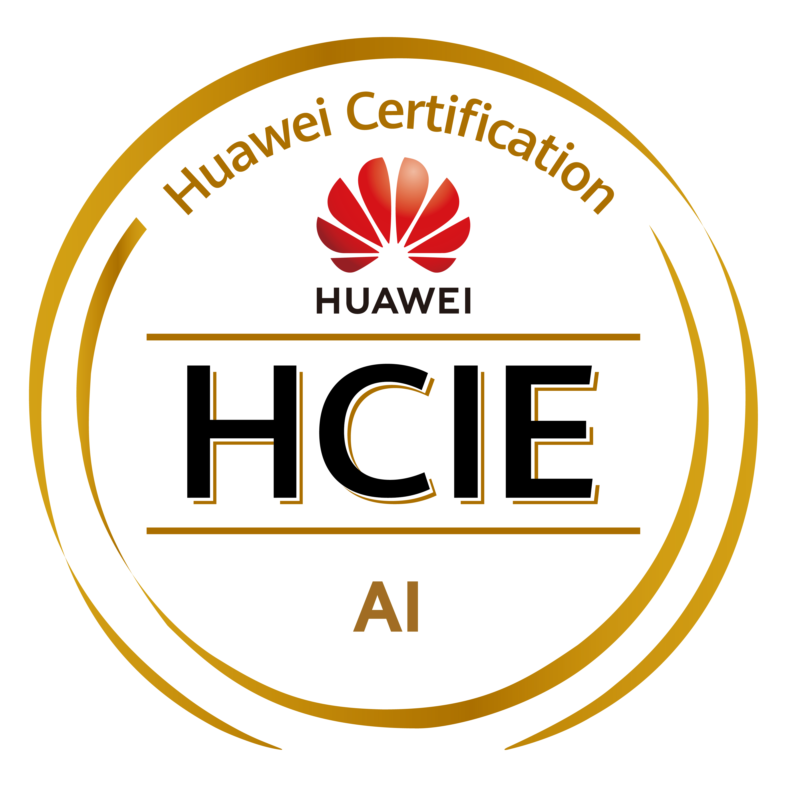

# iiiceoo

*1999-02 | <iiiceoo@foxmail.com> | Go、Kubernetes、AI Infra*

- [iiiceoo](#iiiceoo)
  - [个人简介](#个人简介)
  - [相关技能](#相关技能)
  - [AI Infra](#ai-infra)
  - [证书](#证书)
  - [教育背景](#教育背景)
    - [湖南科技大学](#湖南科技大学)
  - [工作经历](#工作经历)
    - [平安银行股份有限公司](#平安银行股份有限公司)
      - [主要职责](#主要职责)
      - [kfeature (Go)](#kfeature-go)
      - [RequeueIP (Go)](#requeueip-go)
      - [CHPA (Go)](#chpa-go)
    - [上海道客网络科技有限公司 (DaoCloud)](#上海道客网络科技有限公司-daocloud)
      - [Spiderpool (Go)](#spiderpool-go)
    - [创智和宇信息技术股份有限公司](#创智和宇信息技术股份有限公司)
      - [sauto3 (Python3)](#sauto3-python3)
      - [PowerRedis (Java)](#powerredis-java)

## 个人简介

1. GitHub: <https://github.com/iiiceoo>
2. 六年服务端工作经验，熟悉 Kubernetes 及云原生相关生态。
3. 熟练的 Linux、Kubernetes 排障能力。
4. 良好的文档、代码风格和测试规范。
5. 流畅的英文读写能力。

## 相关技能

- 熟练使用 Go 语言。
- 熟练使用 Linux 操作系统。
- 熟练使用 Kubernetes 平台。
- 熟悉 TCP/IP 协议栈，了解 Linux 网络栈。
- 熟悉 BPF，熟练使用 USE 方法，熟悉 bpftrace、BCC 工具集。
- 熟悉 Docker、containerd 容器运行时，理解 Linux Namespace、Cgroups 原理。
- 熟悉 Device Plugin 工作机制，理解 DRA 原理。
- 熟悉 CNI Specification，深入理解 CNI 工作机制与编程范式。熟悉 Multus、Calico、Flannel 等 CNI Plugins。
- 熟悉 Kubernetes API Conventions，深入理解声明式 API，精通 CRD、Controller 编程。熟悉 client-go、controller-runtime 源码。

## AI Infra

- 了解 GPU、TPU、NPU 硬件架构。
- 了解 NVLink、NVSwitch 等高速互联技术。
- 理解 RoCE、InfiniBand 协议栈。
- 理解模型编译原理与训练、推理流程。

## 证书

  

## 教育背景

### 湖南科技大学

- 2016-08 - 2020-08
- 本科 - 信息与计算科学

## 工作经历

### 平安银行股份有限公司

- 2023-07 - 至今
- IaaS 运维工程师

#### 主要职责

1. 云平台 100+ Kubernetes 集群，5000+ 节点及 10w+ Pod 的日常运维、性能分析。
2. 原生 Kubernetes 特性扩展或增强。
3. 昇腾 PD 分离（MindCluster + MindIE Motor）方案落地，RoCE v2 网络配置等工作。

#### kfeature (Go)

kfeature 是一个用于增强原生 Kubernetes 特性的 Controller/Webhook，主要完成以下工作：

- Node CPU、内存资源的超分。
- Node、Namespace 及工作负载的元数据管理。
- Namespace 下 RBAC、ImagePullCred、LimitRange 相关资源的注入。

#### RequeueIP (Go)

RequeueIP 是一个 IPAM CNI Plugin，其搭配 Calico 实现工作负载（Deployment/StatefulSet）的 IP 地址固定。

#### CHPA (Go)

CHPA 是一个统计资源池（持同类标签的 Node）资源请求率及使用率的 Controller，并依据预期的水位线暂停资源池内 HPA 的扩容行为。

### 上海道客网络科技有限公司 (DaoCloud)

- 2021-08 - 2023-06
- 云原生研发工程师

#### Spiderpool (Go)

[Spiderpool](https://github.com/spidernet-io/spiderpool)（CNCF Sandbox）是一个 IPAM CNI Plugin。我是 Spiderpool 的作者之一，其收录于 [Cloud Native Landscape](https://landscape.cncf.io/?item=runtime--cloud-native-network--spiderpool)。

### 创智和宇信息技术股份有限公司

- 2020-05 - 2021-08
- PaaS 研发工程师

#### sauto3 (Python3)

sauto3 是一个基于 paramiko 的自动化运维工具，托管各类中间件由部署到销毁的全生命周期，同时完成云平台相关的运维、数据备份以及容灾任务。

#### PowerRedis (Java)

PowerRedis 是一个 Redis 数据库的可视化界面操作控制台，提供诸如实例自动发现、web-cli、KV 界面管理、参数配置、审计日志、慢日志、热点 Key 等能力。
